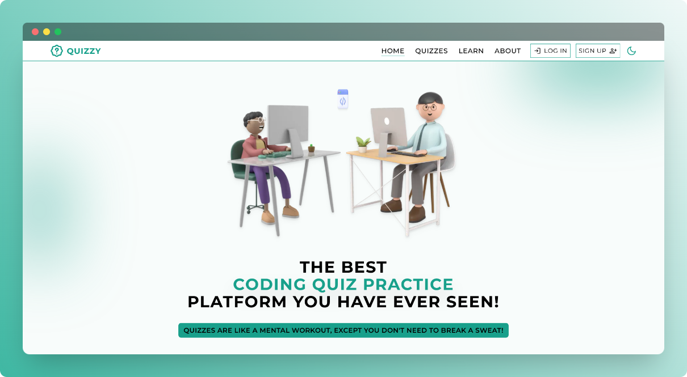
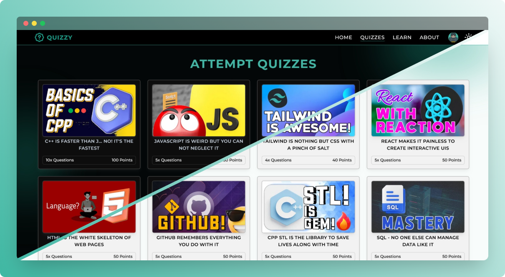
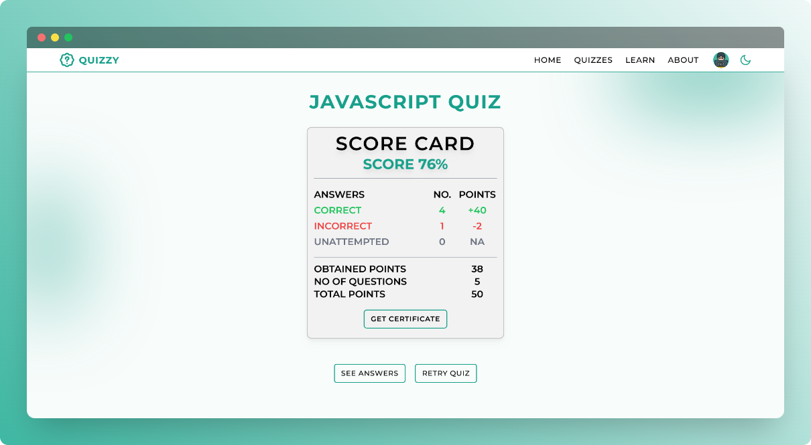
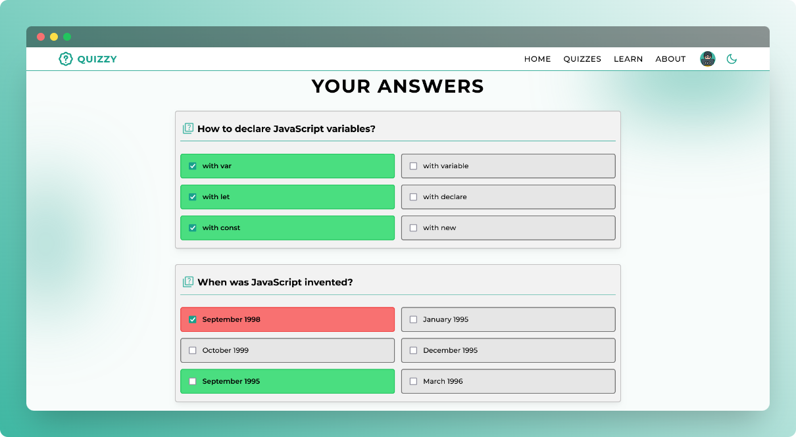
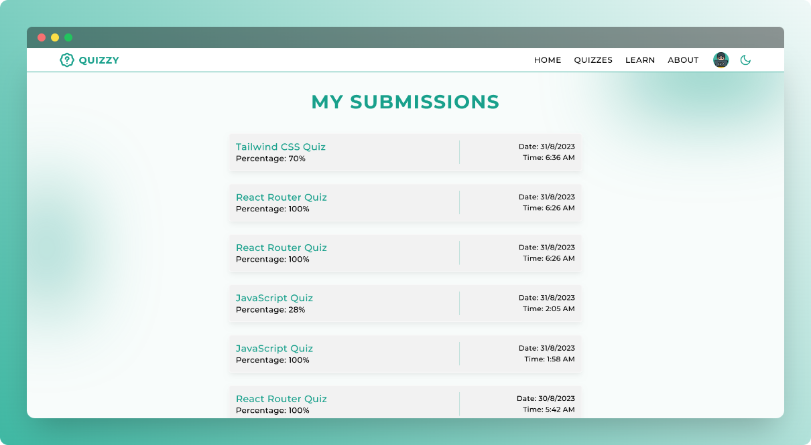
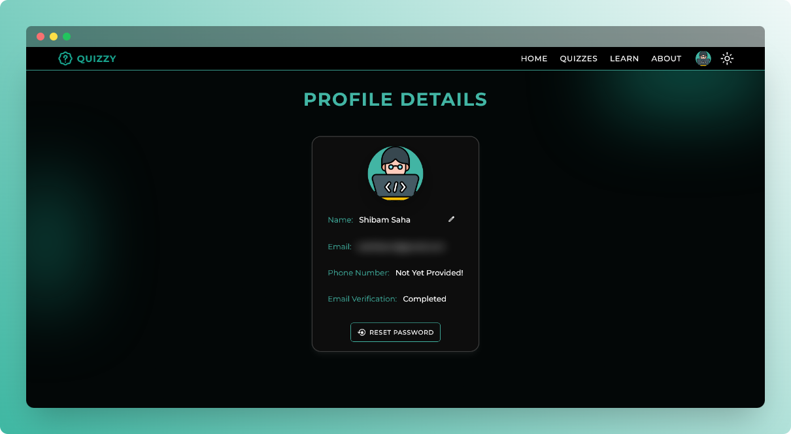

    

    <h1>Cuizzy</h1>
    
Challenge your limits

    
    
    

 

## ⚡ Introduction

Cuizzy is a platform for online computer science or coding quizzes, as well as learning new topics by watching video content on the platform.

## ✨ Features
  
- User experience-centric, modern and responsive interface
- `Dark` and `Light` theme support
- User authentication by `Firebase`
  - Google Signin
  - Email/Password Signin
- Option to edit profile and reset password
- Marking based quizzes
- Certificate on successful completion
- Quiz submission history
- Video tutorials to learn computer science topics

## ⚙️ Tech Stack
  
- React JS
- Tailwind CSS
- Vite JS
- Firebase

## 📦 Other Libraries and Tools
  
- FileSaver JS
- Lodash
- PDF LIB JS
- React Player
- React Router DOM
- React Toastify

## 🎯 Goals

- [x] Master `React JS` and develop a project showcasing proficiency
- [x] Implement public and private routing effectively in a React application
- [x] Establish user authentication using context providers for enhanced security
- [x] Acquire proficiency in NoSQL database principles and query techniques
- [x] Seamlessly integrate a `BAAS` into a React application for streamlined backend operations

## 🖼️ Screenshots

## 👋🏻 Contact

